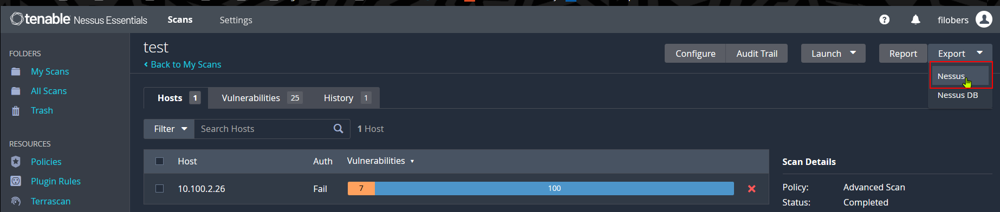

# araday on Parrot OS (should work an all debian based distro)
## Requirements
- docker
- docker-compose
## Installation
    wget https://raw.githubusercontent.com/infobyte/faraday/master/docker-compose.yaml
    sudo docker-compose up -d

## Access the app container
Open another shell and login in faraday app container:

	sudo docker exec -it -u root faraday_app /bin/bash
	Emulate Docker CLI using podman. Create /etc/containers/nodocker to quiet msg.
	root@d8bced873955:/home/faraday#

If you want to disable python warning set the corresponding env variable

	root@6bddec4d08b7:/home/faraday# export PYTHONWARNINGS="ignore"

## Change faraday user password

	root@6bddec4d08b7:/home/faraday# faraday-manage change-password
	Username: faraday
	Password: 
	Repeat for confirmation: 
	Password changed successfully

## Access the web UI
Navigate to: http://localhost:5985/login

Use the credentials you changed before (faraday for both username and password in my case)

## Install Faraday CLI
Create virtual env and install the CLI

	python3 -m venv faraday-env && source faraday-env/bin/activate
	pip3 install faraday-cli

Reference: https://docs.faraday-cli.faradaysec.com 

## Authenticate on the server
(faraday-env) ┌─[filippo@parrot]─[~]

    faraday-cli auth
    Faraday url: http://localhost:5985
    User: faraday
    Password: 
    Saving config
    ✔ Authenticated with faraday: http://localhost:5985

If you want to list the plugin:
(faraday-env) ┌─[filippo@parrot]─[~]

    faraday-plugins list-plugins

## Faraday Plugins: How They Work

Faraday plugins allow integration with external security tools, either by running them directly or by parsing their output reports.

---

### Plugins with `Command = Yes`

These plugins expect the tool to be **installed locally**.

- Examples: `wpscan`, `nmap`, `nuclei`, `dirb`
- Workflow:
  1. Faraday runs the command on your system.
  2. It captures the tool's output.
  3. The output is inserted into the Faraday workspace.
- If the tool is not installed, you will see an error like: sh: 1: wpscan: not found

### Plugins with `Report = Yes`

These plugins work with **output/report files** (XML, JSON, etc.) generated by external tools.

- Examples: Nessus, Burp, Acunetix
- Features:
- The external tool **does not need to be installed locally**.
- Faraday parses the report file and imports it into the workspace.
- Example: You can import a Nessus XML report even if Nessus is not running on your machine.

If `auto_command_detection` is enabled,it will try to process any supported tools (plugins Command = Yes), then sends the info to current workspace (see next nmap example)

## create a workspace
Faraday> workspace create test
✔ Created workspace: test

## Run a scan insided the CLI
    [ws:test]> nmap scanme.nmap.org
    💻 Processing Nmap command
    Starting Nmap 7.94SVN ( https://nmap.org ) at 2025-09-23 16:54 CEST
    Starting Nmap 7.94SVN ( https://nmap.org ) at 2025-09-23 16:54 CEST
    Nmap scan report for scanme.nmap.org (45.33.32.156)
    Host is up (0.21s latency).
    Other addresses for scanme.nmap.org (not scanned): 2600:3c01::f03c:91ff:fe18:bb2f
    Not shown: 994 filtered tcp ports (no-response)
    PORT      STATE SERVICE
    22/tcp    open  ssh
    80/tcp    open  http
    554/tcp   open  rtsp
    7070/tcp  open  realserver
    9929/tcp  open  nping-echo
    31337/tcp open  Elite
    Nmap done: 1 IP address (1 host up) scanned in 37.24 seconds
    ⬆ Sending data to workspace: test
    ✔ Done

You can check the results in the web-gui

## Ingest a Nessus report
You can ingest a Nessus report as follows (I used Nessus Essentials 10.9.3):
1. Export your scan from Nessus

You will get a file with .nessus extension
2. Load the file data into Faraday using the CLI

   		faraday-cli tool report --plugin-id Nessus test.nessus  
		📄 Processing Nessus report
		⬆ Sending data to workspace: test
		
		✔ Done
3. Check the results:

		[ws:test]> stats --type vulns
		⠏ Gathering data
		# Vulnerability stats [test]
		
		▇ vulns  
		
		MONTMARBOOK.xxxxxx.local: ▇▇▇▇▇▇▇▇▇▇▇▇▇▇▇▇▇▇▇▇▇▇▇▇▇▇▇▇▇▇▇▇▇▇▇▇▇▇▇▇▇▇▇▇▇▇▇▇▇▇ 5    
4. Use the web GUI to get detailed informations

## Stop and restart
### Stop venv e docker container
(faraday-env) ┌─[filippo@parrot]─[~]

    deactivate 
    sudo docker-compose down
	
## Restart servers and CLI
	sudo docker-compose up -d
	source faraday-env/bin/activate
	faraday-cli

