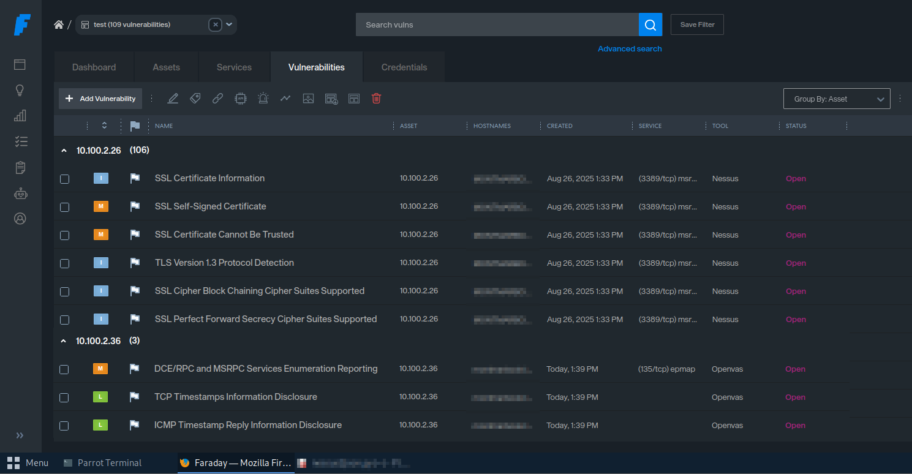

#  Faraday on Parrot OS (should work on all Debian-based distros)

## Requirements
- docker
- docker-compose

## Installation
```bash
wget https://raw.githubusercontent.com/infobyte/faraday/master/docker-compose.yaml
sudo docker-compose up -d
```

## Access the app container
Open another shell and log into the Faraday app container:

```bash
sudo docker exec -it -u root faraday_app /bin/bash
```

You might see a message like:
```
Emulate Docker CLI using podman. Create /etc/containers/nodocker to quiet msg.
root@d8bced873955:/home/faraday#
```

If you want to disable Python warnings, set the corresponding environment variable:

```bash
export PYTHONWARNINGS="ignore"
```

## Change Faraday user password
```bash
faraday-manage change-password
Username: faraday
Password: 
Repeat for confirmation: 
Password changed successfully
```

## Access the Web UI
Navigate to: http://localhost:5985/login

Use the credentials you changed before (I set: `faraday` / `faraday`).

## Install Faraday CLI
Create a virtual environment and install the CLI:

```bash
python3 -m venv faraday-env && source faraday-env/bin/activate
pip3 install faraday-cli
```

Reference: https://docs.faraday-cli.faradaysec.com

## Authenticate on the server
```bash
faraday-cli auth
Faraday url: http://localhost:5985
User: faraday
Password: 
Saving config
✔ Authenticated with faraday: http://localhost:5985
```

To list available plugins:
```bash
faraday-plugins list-plugins
```

---

## Faraday Plugins: How They Work
Faraday plugins allow integration with external security tools, either by running them directly or by parsing their output reports.

### Plugins with `Command = Yes`
These plugins expect the tool to be **installed locally**.

- Examples: `wpscan`, `nmap`, `nuclei`, `dirb`
- Workflow:
  1. Faraday runs the command on your system.
  2. It captures the tool's output.
  3. The output is inserted into the Faraday workspace.

If the tool is not installed, you will see an error like:
```
sh: 1: wpscan: not found
```

### Plugins with `Report = Yes`
These plugins work with **output/report files** (XML, JSON, etc.) generated by external tools.

- Examples: Nessus, Burp, Acunetix
- Features:
  - The external tool **does not need to be installed locally**.
  - Faraday parses the report file and imports it into the workspace.
- Example: You can import a Nessus XML report even if Nessus is not running on your machine.

If `auto_command_detection` is enabled, Faraday will try to process any supported tools (`Command = Yes` plugins) and send the info to the current workspace.

---

## Create a workspace
```bash
Faraday> workspace create test
✔ Created workspace: test
```

## Run a scan inside the CLI
```bash
[ws:test]> nmap scanme.nmap.org
💻 Processing Nmap command
Starting Nmap 7.94SVN ( https://nmap.org ) at 2025-09-23 16:54 CEST
Nmap scan report for scanme.nmap.org (45.33.32.156)
Host is up (0.21s latency).
Other addresses for scanme.nmap.org (not scanned): 2600:3c01::f03c:91ff:fe18:bb2f
Not shown: 994 filtered tcp ports (no-response)
PORT      STATE SERVICE
22/tcp    open  ssh
80/tcp    open  http
554/tcp   open  rtsp
7070/tcp  open  realserver
9929/tcp  open  nping-echo
31337/tcp open  Elite
Nmap done: 1 IP address (1 host up) scanned in 37.24 seconds
⬆ Sending data to workspace: test
✔ Done
```

You can check the results in the web GUI.

---

## Ingest a Nessus report
You can ingest a Nessus report as follows (tested with Nessus Essentials 10.9.3):

1. Export your scan from Nessus  
     
   You will get a file with a `.nessus` extension.

2. Load the file data into Faraday using the CLI:
   ```bash
   faraday-cli tool report --plugin-id Nessus test.nessus  
   📄 Processing Nessus report
   ⬆ Sending data to workspace: test
   ✔ Done
   ```

3. Check the results:
   ```bash
   [ws:test]> stats --type vulns
   ⠏ Gathering data
   # Vulnerability stats [test]
   ▇ vulns  
   YYYYYYYY.xxxxxx.local: ▇▇▇▇▇▇▇▇▇▇▇▇▇▇▇▇▇▇▇▇▇▇▇▇▇▇▇▇▇▇▇▇▇▇▇▇▇▇▇▇▇▇▇▇▇▇▇▇▇▇ 5
   ```

---

## Ingest an OpenVAS report
1. Export your report from OpenVAS in XML format:
   

2. Then import it into Faraday using the CLI:

```bash
faraday-cli tool report --plugin-id Openvas openvas-test.xml 
📄 Processing Openvas report
⬆ Sending data to workspace: test
✔ Done
```

---

## Access Faraday GUI to get detailed information


---

## Stop and restart Faraday

### Stop venv and Docker containers
```bash
deactivate 
sudo docker-compose down
```

### Restart servers and CLI
```bash
sudo docker-compose up -d
source faraday-env/bin/activate
faraday-cli
```
